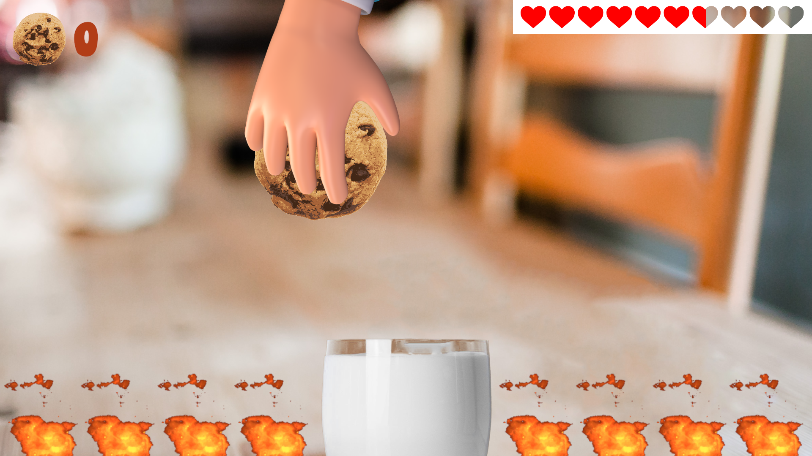
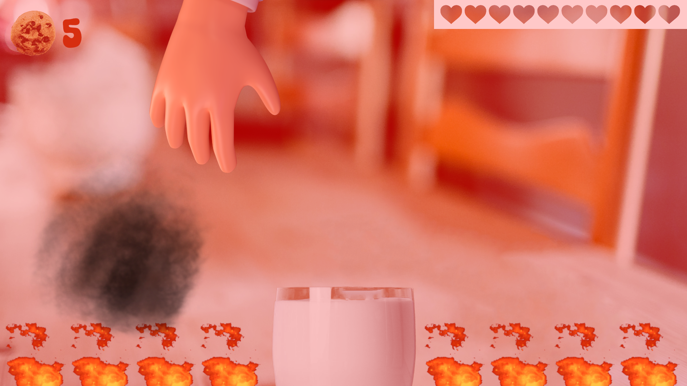
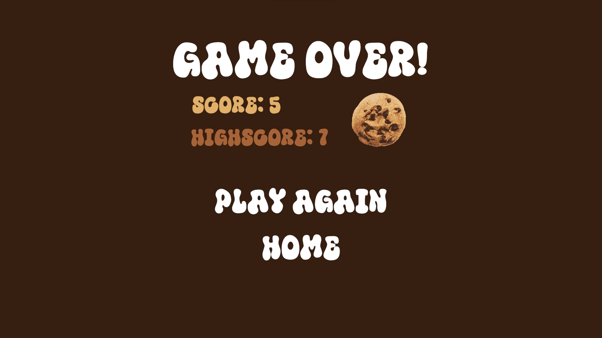
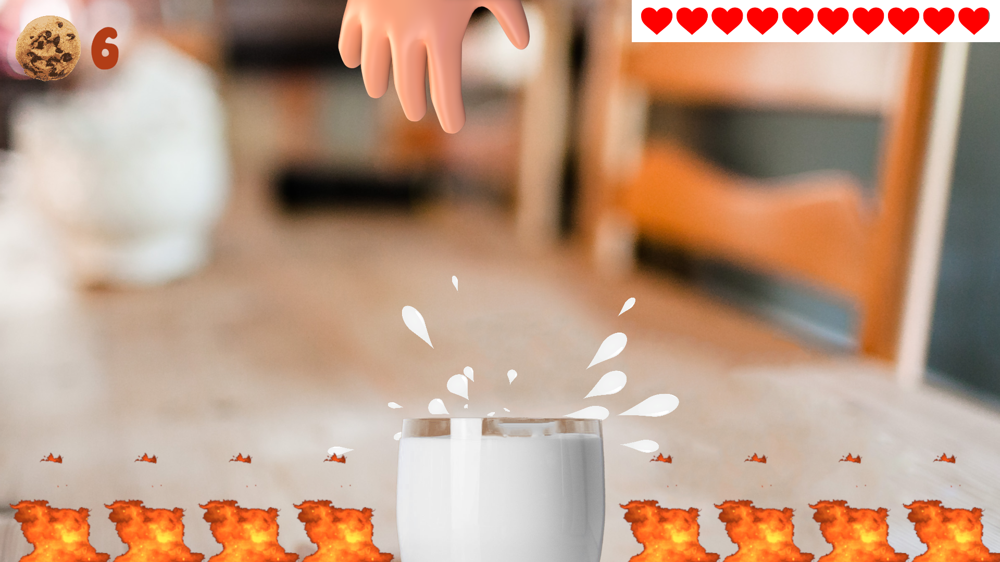

# Dunk The Cookie - Tiny Game Assignment
<a href="https://lenibi.github.io/Tiny-Game---Dunk-The-Cookie/">Click Here To Play</a>
#### Please allow some loading time! Project may take from 5 seconds to a minute to load. 
Works best on a PC 1080p 16:9 screen. Runs on mobile horizontally but not as well. On mobile, rotating screen orientation may break the game.

## Description

Simple cookie game for a small assignment. Dunk the cookie in the milk glass to get points.

## How to play

* Left mouse click or space bar to drop the cookie.
* Health decreases over time.
* Land the cookie in the fire, or run out of health and you lose.
* Land the cookie in the milk to replenish health and increase score.
* Hand/Cookie moves faster over time to increase difficulty.
  
